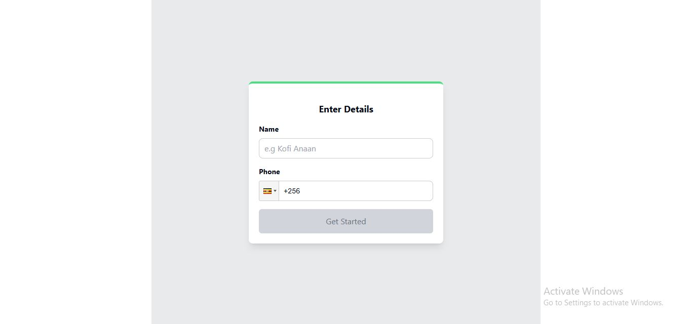
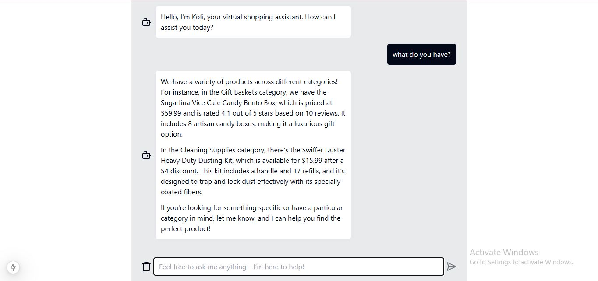

# This is a Proof Of Concept (POC) Sales-Assistant bot created with Next js, Tailwind-css, Langchain, Vercel AI SDK & OpenAI API

## Introduction

The digital commerce landscape demands intelligent systems that enhance customer engagement by offering seamless, interactive, and personalized experiences. This project leverages Next.js, Tailwind CSS, and MongoDB for a robust front-end and back-end setup, coupled with LangChain, OpenAI API, and Vercel AI SDK to create an AI-driven sales assistant bot. The bot answers product-related queries, provides recommendations, and guides users through the sales process with precision and efficiency.

## Table of Contents

[1. **Design Phase**](#1-Design-Phase)
   - Solution Architecture
   - Prompt Engineering
     
[2. **Implementation Phase**](#2-Implementation-Phase)
   - Prototype Development
   - Integration with external data

3. **Testing Phase**
   - Test cases for validation
  
4. **Analysis Phase**  
   - Bot Performance Evaluation  
   - Bot Limitations and Areas for Improvement
  
5. **Conclusion**  
    - Summary of Achievements  
    - Future Directions for Scalability and Improvement
  
## 1. Design Phase  

  

The design process consists of the following steps:

1. **Dataset Preparation**:  
   A CSV file containing product data from Costco's online marketplace is used as the dataset; find it here [Dataset](https://www.kaggle.com/datasets/bhavikjikadara/grocery-store-dataset). It includes 19 sub-categories, with each product having attributes    such as price, ratings, discounts, title, features, and product descriptions.
   
   This dataset is embedded into **Pinecone**, a vector database, using the **OpenAI text-embedding model** for efficient similarity search.  

3. **Query Handling**:  
   When a user sends a query:  
   - If the query does not require additional context (e.g., "Hey"), it is directly combined with the prompt and sent to the **LLM** (Large Language Model), which generates a response.  
   - If the query requires contextual data from the Costco dataset (e.g., "What products do you have?"), the query is embedded and a similarity search is performed in the vector database 
     to retrieve relevant information.  

4. **Generating the Output**:  
   The relevant information retrieved from the similarity search is combined with the user query and prompt. This enriched data is then sent to the **LLM**, which generates the desired      output for the user.  

This design ensures the bot can handle both general and context-specific queries effectively, leveraging the power of embeddings and similarity search for precise responses.

## 2. Implementation Phase

The implementation phase is divided into two key steps:

### a) User Phone Number Data Gathering



In this step, a **MongoDB database** was used to store customer phone numbers.  
The primary purpose of collecting users' phone numbers is to enable **cold marketing campaigns**, allowing targeted outreach to potential customers.

### b) Creating an AI-Powered Shopping Assistant



An **AI-powered shopping assistant** was developed using the embedded dataset stored in the **Pinecone database**.  
This setup provides the chatbot with **context-awareness**, enabling it to understand and address user needs effectively. By leveraging the embedded dataset, the chatbot can deliver relevant and personalized assistance to users.


## Getting Started

First, run the development server:

```bash
npm run dev
# or
yarn dev
# or
pnpm dev
# or
bun dev
```

Open [http://localhost:3000](http://localhost:3000) with your browser to see the result.
